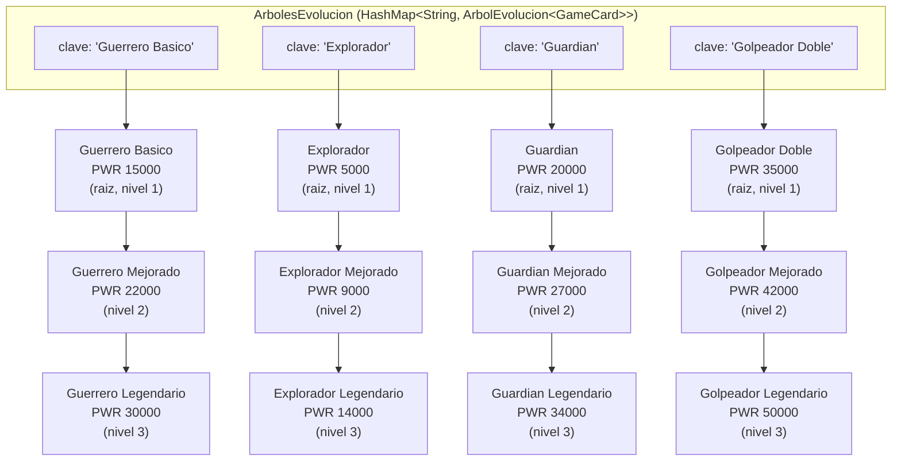

# Diagrama de Arbol: Arbol de Evolucion de cartas

Este diagrama corresponde exactamente a la implementacion en
`dbfw.cardgame.arbol` (paquete `dbfw-game/src/dbfw/cardgame/arbol`):

- **`NodoArbol<T>`** — nodo del arbol: guarda un valor (`GameCard`) y una
  `ListaSimple<NodoArbol<T>>` propia con sus hijos directos.
- **`ArbolEvolucion<T>`** — envuelve la raiz (`NodoArbol<T>`) y expone
  `recorrerCompleto(...)`, que recorre el arbol en preorden con el metodo
  recursivo real `recorrerRecursivo(...)`.
- **`ArbolesEvolucion`** — tabla hash (`HashMap<String, ArbolEvolucion<GameCard>>`)
  que indexa **un `ArbolEvolucion` por familia**, buscando por el nombre de su
  nivel basico (ej. `"Guardian"`).

Cada familia tiene exactamente **3 niveles** (3 nodos, sin ramificacion):
nivel 1 = raiz (basica, la que ya usa el mazo), nivel 2 = hijo directo de la
raiz (mejorada), nivel 3 = hijo directo del nivel 2 (legendaria). Los nombres
y valores de poder (`getBasePower()`) son literalmente los que registra
`ArbolesEvolucion.registrarLinea(...)` en su bloque `static { ... }`.



## Como leer el diagrama junto con el codigo

| En el diagrama | En el codigo |
|---|---|
| Caja `HASH` | `ArbolesEvolucion.ARBOLES` (`Map<String, ArbolEvolucion<GameCard>>`) |
| Flecha `K3 --> GD1` | `ArbolesEvolucion.buscar("Guardian")` devuelve el `ArbolEvolucion` cuya raiz es `GD1` |
| Nodo `GB1` | `ArbolEvolucion.getRaiz()` → `NodoArbol<GameCard>` con `valor = new GameCard("Guerrero Basico", 15000, 0, CardType.BASIC)` |
| Flecha `GB1 --> GB2` | `raiz.agregarHijo(...)` guardo a `GB2` dentro de la `ListaSimple<NodoArbol<T>>` de hijos de `GB1` |
| Flecha `GB2 --> GB3` | `mejorada.agregarHijo(...)` guardo a `GB3` dentro de los hijos de `GB2` |

## Recorrido recursivo (metodo `recorrerRecursivo`)

`ArbolEvolucion.recorrerCompleto(...)` llama a `recorrerRecursivo(raiz, 0, ...)`,
que visita el nodo actual y luego se llama a si mismo una vez por cada hijo
(caso base: un nodo sin hijos, como los de nivel 3, donde el `for` de hijos no
itera y esa rama de la recursion termina). Para la familia "Guardian" el
recorrido impreso en el dialogo "Ver Arbol de Evolucion" es:

```
Guardian (PWR 20000)
  |- Guardian Mejorado (PWR 27000)
    |- Guardian Legendario (PWR 34000)
```
